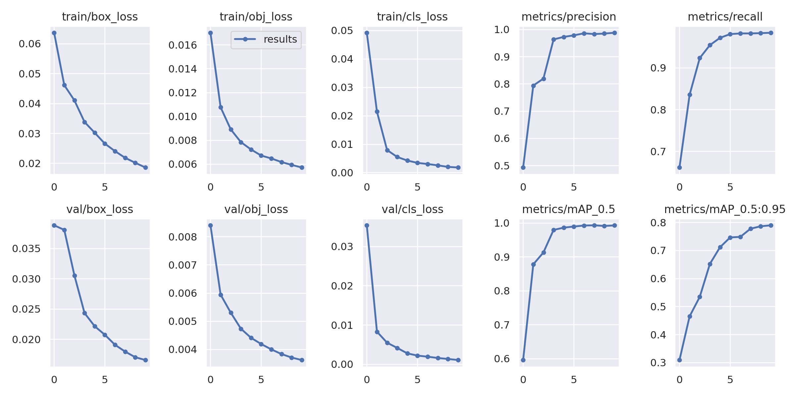
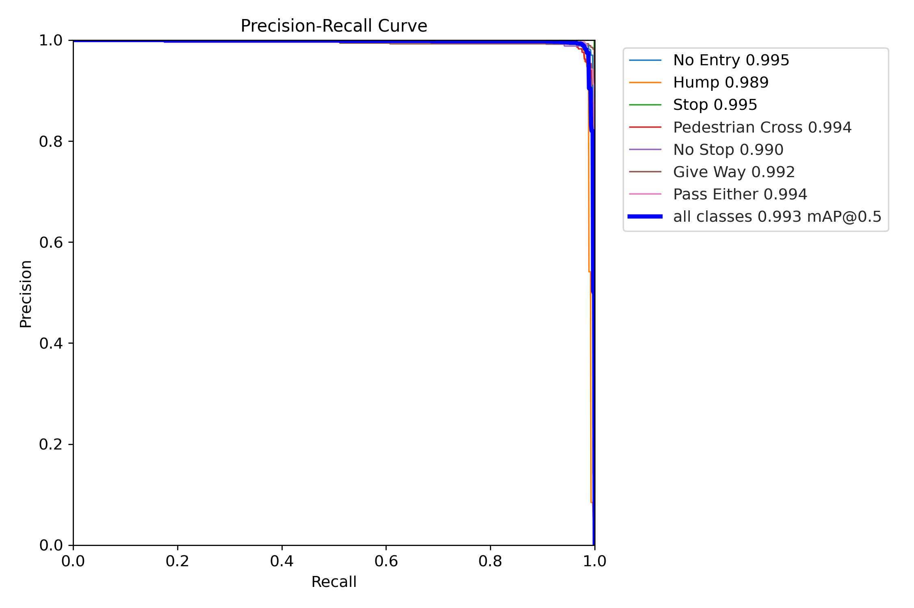
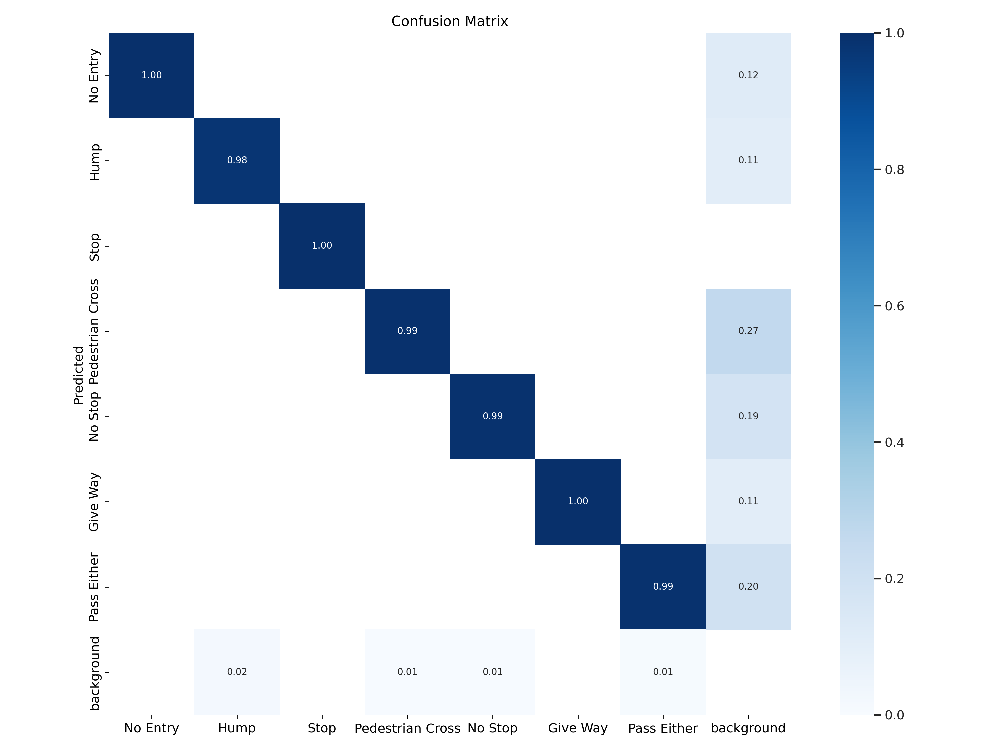
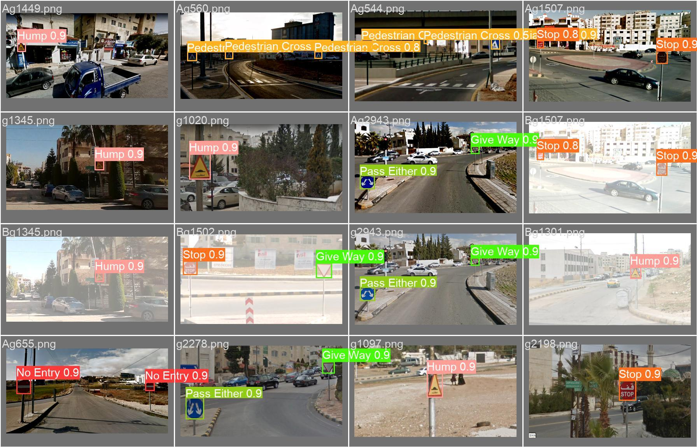
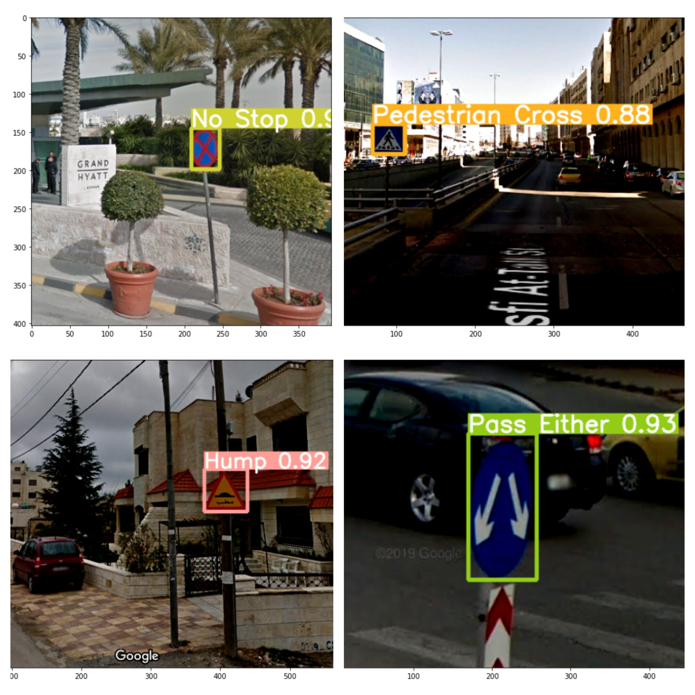
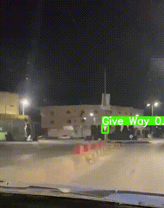
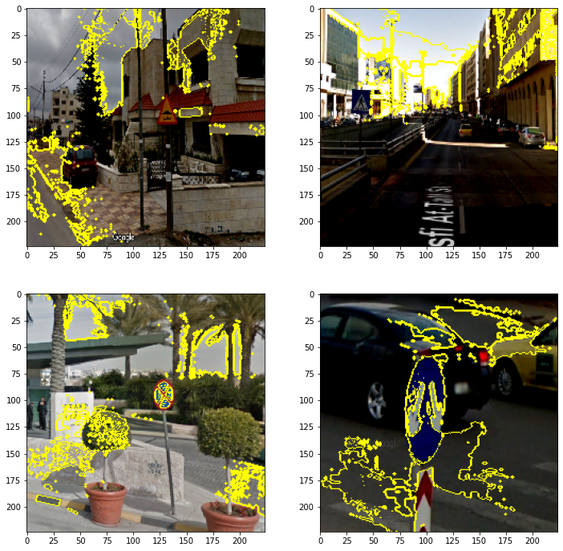
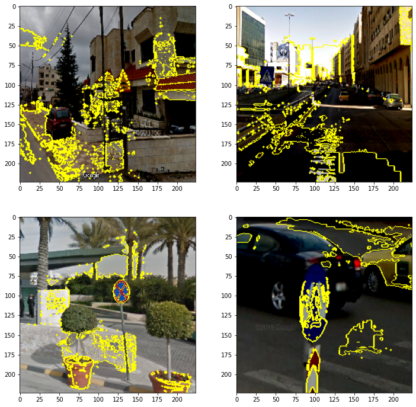
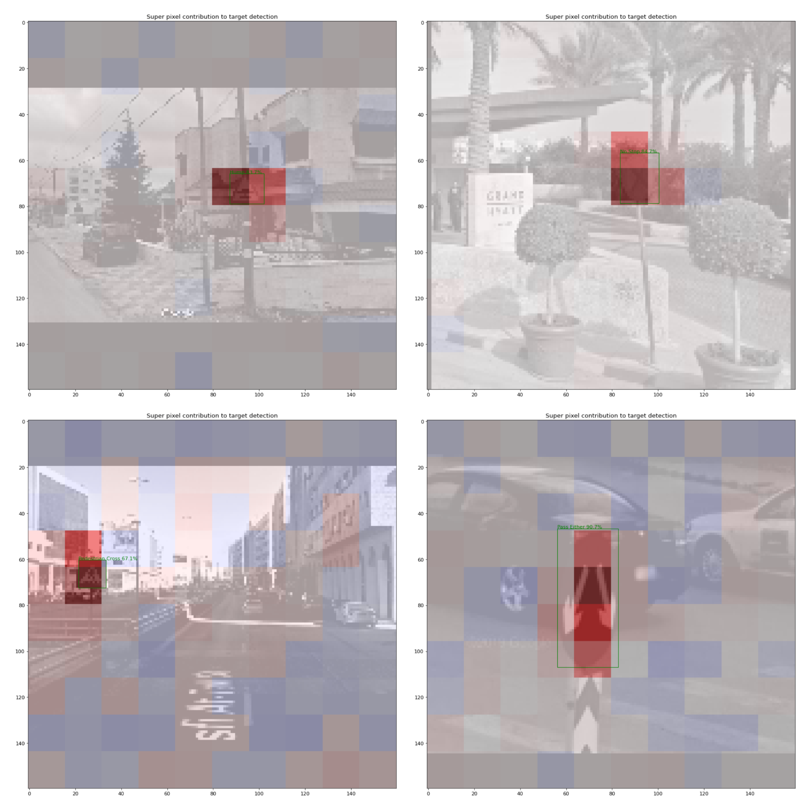

# Jordanian Traffic Sign Detection and Explainability

This repository contains a master's course project completed for the Deep Learning course **CIS 735**.

The project studies traffic-sign recognition in realistic Jordanian street scenes. It combines exploratory data analysis, multi-label image classification, object detection, manual image and video testing, and explainable AI. The original proposal emphasized that these images contain full street contexts, including cars, buildings, vegetation, and sometimes more than one traffic sign, rather than isolated sign crops.

## Problem statement

The goal is to identify seven Jordanian traffic-sign classes and, for the detection track, localize each sign with a bounding box:

| ID | Class |
|---:|---|
| 0 | No Entry |
| 1 | Hump |
| 2 | Stop |
| 3 | Pedestrian Cross |
| 4 | No Stop |
| 5 | Give Way |
| 6 | Pass Either |

The work contains two related formulations:

1. Multi-label image classification with a custom CNN and a frozen VGG16 backbone.
2. Multi-object detection with YOLOv5s, including test-image and short-video inference.

LIME is used with the CNN models, while a superpixel-based Kernel SHAP procedure is used to interpret selected YOLOv5 detections.

## Dataset

The project uses [Jordanian (Arabic) Traffic Signs in YOLO Format](https://www.kaggle.com/datasets/khaledhweij/jordanian-traffic-signs) by Khaled Hweij on Kaggle.

The original project materials report:

- 9,246 images
- 10,566 annotated traffic-sign instances
- Seven classes
- Images collected in Amman, Jordan
- 6,923 training images, 1,623 validation images, and 700 test images

The dataset is external and is not redistributed in this repository.

### Download the dataset

1. Create a Kaggle account and generate API credentials from your Kaggle account settings.
2. Keep credentials outside this repository. The preferred method is to set temporary environment variables:

   Linux or macOS:

   ```bash
   export KAGGLE_USERNAME="your_username"
   export KAGGLE_KEY="your_key"
   ```

   Windows PowerShell:

   ```powershell
   $env:KAGGLE_USERNAME="your_username"
   $env:KAGGLE_KEY="your_key"
   ```

3. From the repository root, download and extract the archive:

   ```bash
   kaggle datasets download -d khaledhweij/jordanian-traffic-signs -p data
   python -m zipfile -e data/jordanian-traffic-signs.zip data
   ```

4. Delete the downloaded ZIP after extraction. It is ignored by Git and should not be committed.
5. Confirm that the extracted folder matches this structure:

   ```text
   data/
   └── Final_Dataset/
       ├── images/
       │   ├── train/
       │   ├── val/
       │   └── test/
       └── labels/
           ├── train/
           ├── val/
           └── test/
   ```

If the dataset is stored elsewhere, set `JTS_DATASET_ROOT` to the local `Final_Dataset` directory. The notebooks use `pathlib.Path` and environment-variable overrides instead of Colab-specific paths.

## Methodology

### Exploratory analysis

The first notebook checks the number of signs per image, class distribution in each split, and the train, validation, and test proportions. YOLO-format label files are matched to their image stems.

### Custom CNN

The custom network uses two convolution and max-pooling blocks, dropout, a 128-unit dense layer, and a seven-unit sigmoid output. It is trained with binary cross-entropy for ten epochs. The sigmoid output supports multiple active classes in one image.

### VGG16 transfer learning

The VGG16 convolutional base is initialized with ImageNet weights and frozen. Global average pooling and a small dense classification head produce seven sigmoid outputs. Early stopping monitors validation loss and restores the best weights.

### YOLOv5 detection

The detection experiment uses YOLOv5s with pretrained weights, 416-pixel inputs, batch size 16, and ten epochs. It predicts class labels, confidence scores, and bounding boxes for one or more signs in a scene. The updated notebook targets the YOLOv5 `v7.0` tag to remain close to the archived experiment.

### Explainable AI

- LIME segments a test image into superpixels and shows the regions used in a local CNN or VGG16 explanation.
- Kernel SHAP perturbs a grid of superpixels and scores their effect on a selected YOLO detection. The overlays show relative positive and negative contributions around the target box.

## Recorded results

The following results were recorded during the course experiments and are documented in the notebooks and `outputs/yolov5/results.csv`.

| Model | Recorded result |
|---|---|
| Custom CNN | Epoch 10 training accuracy 81.54%, validation accuracy 69.62%, validation loss 0.3074 |
| VGG16 | Highest displayed validation accuracy 88.17% at epoch 24 |
| VGG16 early-stopping checkpoint | Lowest validation loss 0.1093 at epoch 21, with validation accuracy 87.12% |
| YOLOv5s | Final precision 98.77%, recall 98.37%, mAP@0.5 99.26%, mAP@0.5:0.95 78.96% |
| YOLOv5 test inference | Archived run reports about 10.6 ms inference per image at 416 by 416 on a Tesla T4 environment |

The accuracy values for the CNN tracks are Keras training metrics from the archived run. Because this is a multi-label task, they should not be treated as a complete evaluation without per-class precision, recall, F1, calibration, and held-out test analysis.

## Experiment figures

### YOLOv5 training behavior



The loss curves decrease across the ten epochs, while precision, recall, mAP@0.5, and mAP@0.5:0.95 increase. This plot provides the full learning trajectory rather than only the final metrics.

### Precision-recall performance



The archived curve reports an aggregate mAP@0.5 of approximately 0.993, with strong class-level curves across all seven signs.

### Confusion matrix



The normalized confusion matrix is strongly concentrated on the diagonal. The background column also shows some missed detections, which is important when interpreting the high aggregate metrics.

### Validation predictions



This batch demonstrates localization and classification across varied daylight scenes, sign sizes, viewing angles, and images containing more than one sign.

## Manual tests



The manually selected images test the detector outside the displayed validation batch. The model localizes No Stop, Pedestrian Cross, Hump, and Pass Either signs in full street scenes and attaches confidence scores to each prediction.

### Short video test



The short night-time sequence shows frame-by-frame detection of a Give Way sign. [Open the MP4 prediction](assets/demo/give_way_prediction.mp4) or compare it with the [source clip](assets/demo/give_way_source.mp4).

## Explainability examples

### LIME with the custom CNN



The yellow boundaries mark the superpixels used by the local explanation. The examples help inspect whether the classifier relies on the sign region or on surrounding scene content.

### LIME with VGG16



The VGG16 explanations provide a qualitative comparison with the custom CNN on the same four manually selected scenes.

### SHAP with YOLOv5



The SHAP overlays map relative superpixel contributions to selected detections. Red and blue regions represent opposite contribution directions after normalization, while the green box marks the detection being explained. These figures are local, model-specific explanations and should not be interpreted as causal evidence.

## Repository structure

```text
.
├── assets/
│   ├── demo/                 # Source video, prediction video, and GIF preview
│   ├── manual-tests/         # Manual images and detection montage
│   ├── results/              # Selected YOLOv5 diagnostics
│   ├── xai/                  # LIME and SHAP figures
│   └── ATTRIBUTION.md
├── config/
│   └── jordanian_traffic_signs.yaml
├── data/
│   └── README.md             # External dataset instructions
├── models/
│   └── README.md             # Checkpoint policy and expected paths
├── notebooks/
│   ├── 01_exploring_data.ipynb
│   ├── 02_custom_cnn_lime.ipynb
│   ├── 03_vgg16_lime.ipynb
│   └── 04_yolov5_shap.ipynb
├── outputs/
│   └── yolov5/               # Compact recorded metrics and hyperparameters
├── tools/
│   └── validate_repository.py
├── .env.example
├── .gitignore
├── README.md
└── requirements.txt
```

## Installation

Python 3.10 is recommended for the combined TensorFlow and YOLOv5 environment.

```bash
python -m venv .venv
```

Activate the environment:

Linux or macOS:

```bash
source .venv/bin/activate
```

Windows PowerShell:

```powershell
.venv\Scripts\Activate.ps1
```

Install the project dependencies:

```bash
python -m pip install --upgrade pip
python -m pip install -r requirements.txt
```

For the YOLO notebook, clone the historical YOLOv5 release without adding it to this repository:

```bash
git clone --branch v7.0 --depth 1 https://github.com/ultralytics/yolov5.git external/yolov5
python -m pip install -r external/yolov5/requirements.txt
```

If YOLOv5 is stored elsewhere, set `JTS_YOLOV5_DIR`.

## Run the notebooks

Start Jupyter from the repository root:

```bash
jupyter lab
```

Recommended order:

1. `notebooks/01_exploring_data.ipynb`
2. `notebooks/02_custom_cnn_lime.ipynb`
3. `notebooks/03_vgg16_lime.ipynb`
4. `notebooks/04_yolov5_shap.ipynb`

The notebooks check for the dataset, YOLOv5 checkout, input media, and required checkpoint, then provide a clear message when a required file is missing.

Run the repository validation before committing changes:

```bash
python tools/validate_repository.py
```

After downloading the external dataset, also validate its required directories:

```bash
python tools/validate_repository.py --check-dataset
```

## Reproducibility notes

- The recorded notebook outputs document the original course runs.
- Repository-relative paths, optional environment variables, deterministic seeds, and clear missing-file checks support local execution on different operating systems.
- Exact results can vary with operating system, GPU, CUDA and cuDNN versions, dependency builds, random initialization, and upstream YOLOv5 changes.
- The YOLO notebook creates a runtime dataset YAML containing the resolved local dataset path. That generated file is ignored by Git.
- SHAP explanations are computationally expensive and may require a CUDA-capable GPU for practical execution time.

## Limitations

- The detector was trained for only ten epochs, so the experiment is a course-scale study rather than a production benchmark.
- The seven classes and Amman-centered imagery do not represent every sign or road condition in Jordan.
- The manual image and video tests are qualitative and small.
- The archived CNN evaluations do not include a comprehensive held-out multi-label metric suite.
- LIME and SHAP explanations are sensitive to segmentation, perturbation, target selection, sampling, and model version.
- Domain shift may reduce performance under different cameras, weather, lighting, road layouts, or countries.

## Dataset citation, terms, and third-party software

Dataset attribution: Khaled Hweij, [Jordanian (Arabic) Traffic Signs in YOLO Format](https://www.kaggle.com/datasets/khaledhweij/jordanian-traffic-signs), Kaggle.

The dataset remains governed by the license and usage terms displayed on its current Kaggle page. This repository does not assert a separate license for the dataset or redistribute its training, validation, or test files.

YOLOv5 is maintained by [Ultralytics](https://github.com/ultralytics/yolov5) and remains governed by its own license. Its source is downloaded separately and is not included here.

Attribution details for the included test media and derived figures are provided in `assets/ATTRIBUTION.md`.
